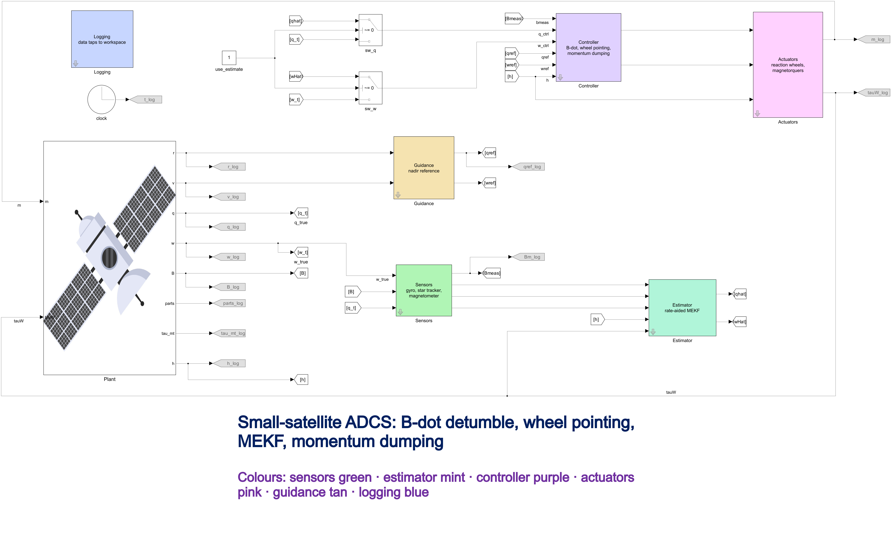

# Small-satellite ADCS simulator: detumble, nadir pointing, attitude estimation

Simulink model of the attitude determination and control of a generic 150 kg Earth-observation smallsat in a 600 km dawn-dusk Sun-synchronous orbit. It takes the spacecraft from a tumble after separation to sub-0.01° nadir pointing with the attitude estimate in the control loop, and checks every step against requirements and an independent plain-MATLAB reference.


*Three orbits of the Simulink run. Tumble, B-dot detumble with magnetorquers, hand-over to the reaction wheels at about 8800 s, nadir capture, then magnetic momentum dumping. The slow-motion window shows the capture, logged every 0.5 s.*

## What it does

| Phase | What happens | Law |
|---|---|---|
| Detumble | Tip-off of up to 6°/s removed with magnetorquers only | B-dot, `m = -k dB/dt`, gain hand-sized from the orbit-averaged field |
| Capture and pointing | Reaction wheels slew to nadir and hold it | PD on the error quaternion with a slew-rate limit (ωn 0.15 rad/s, ζ 0.7) |
| Momentum dumping | Torquers unload the wheels | `m = B × τ / ‖B‖²` with `τ = -kh·h` |
| Estimation | Attitude, rate, gyro bias and disturbance torque from gyro, star tracker and magnetometer | 12-state rate-aided multiplicative EKF |

The plant includes J2, gravity gradient, solar radiation pressure, drag and a residual dipole. Spacecraft values (inertia, areas, wheel and torquer limits) are my own assumptions for a generic satellite, not data of a real mission. They are listed in `src/params/smallsat_params.m`.

## Results

All numbers come from this repository, estimate in the loop, and are explained in [`docs/requirements.md`](docs/requirements.md). The requirement values are my own assumptions, written after the first runs, not before.

| Quantity | Result |
|---|---|
| Pointing error after capture (mission run) | 0.0042° mean, 0.0097° max |
| Capture (error below 0.1°) after hand-over | 166 s in the mission run, worst 180 s in 30 Monte Carlo runs |
| Pointing error, Monte Carlo (30 runs, last 2000 s) | 0.0048° mean, worst max 0.0176° |
| Attitude knowledge error | 14.3 arcsec rms (worst 17.1), 99.7 % of samples inside the filter's 3σ |
| Detumble from up to 6°/s to below 0.5°/s | within 2 orbits in 28 of 30 runs, **2 runs fail** (12 120 s and 12 380 s against 11 600 s) |
| Torquer dipole after hand-over | peak 18.7 A·m² in the mission run, worst 28.6 of 30 A·m² in the Monte Carlo (thin margin) |
| Simulink model vs independent MATLAB reference | 50 of 50 checks within stated limits |

## Star tracker outage

The star tracker is switched off for 1800 s at 14 000 s. The filter runs on the gyro alone. Its error grows with the gyro angle random walk (0.003°/√s) and stays inside the filter's own 3σ bound in 100 % of samples. Peak knowledge error is 673 arcsec, against a 3σ peak of 2501 arcsec. Pointing is not held during the outage: 0.18° at 1800 s. It is back under 0.03° 20 s after the star tracker returns.


## Model structure



Colours: sensors green, estimator mint, controller purple, actuators pink, guidance tan, logging blue. The controller, estimator and sensor subsystems are in `docs/images/` (`controller.png`, `estimator.png`, `sensors.png`).

## Verification

- `simulink_crosscheck(true)` runs the Simulink model against a plain-MATLAB reference propagated at tighter tolerance: open loop, B-dot, wheel pointing, pointing with momentum dumping, and pointing with a plant inertia that differs from the controller's. 50 checks, thresholds fixed before the first run.
- `reference_check`, `star_check`, `gyro_check`, `mekf_check`, `estimator_crosscheck` and `dump_check` test the orbit and environment models, the sensor models, the filter and the dumping law separately.
- `experiments/run_monte_carlo.m` varies tip-off rate, initial attitude, gyro bias and noise seeds (30 runs), optionally with a plant inertia up to 10 % off per axis.

## Limits

I report these on purpose. Details are in [`docs/requirements.md`](docs/requirements.md).

- **Detumble requirement fails in 2 of 30 runs.** The 11 600 s limit has no mission driver, so I report the failure rather than moving the limit. Detumble time depends on the tumble direction relative to the field as much as on the rate.
- **Capture overshoots.** The rate loop lags the commanded rate, so the pointing error falls to about 0.3°, rises to about 0.7° and settles below 0.1° about 20 s later. This is from one run. A lower slew limit or an earlier-decelerating profile would soften it; neither is implemented.
- **The slew-rate limit is per axis,** not on the vector norm, so a slew about a diagonal axis reaches up to √3 times the 1°/s limit (1.49°/s in the mission run).
- **The estimator is overconfident with unmodelled white torque noise,** and loses consistency when a constant torque spins the body to about 1°/s without a controller (requirement R8 is only partly met).
- **Torquer margin is thin** (28.6 of 30 A·m² worst case).
- **Idealisations:** no wheel jitter or friction, no flexible modes, no tracker latency, bias or blinding, white gyro noise only. The Monte Carlo does not vary centre of mass, actuator error or disturbance size.
- Orbit and environment are simplified (J2, exponential atmosphere, dipole field); this is not a mission-analysis tool.

## Run it

Developed and tested on MATLAB R2025b with Simulink. I have not tested other releases.

```matlab
startup                          % adds the project folders to the path
simulink_crosscheck(true)        % 50 checks, a few minutes
run_mission                      % full three-orbit run, estimate in the loop
```

Other experiments are in `experiments/` (`run_monte_carlo`, `run_outage`, `run_estimator_robustness`, `run_pointing_sweep`).

The replay videos are rendered from logged data: `export_replay_data` writes the CSVs, `python visualization/render_replay.py mission` (needs Python 3, numpy, scipy, matplotlib and ffmpeg) turns them into video. `globe_intro` opens the orbit on a 3D globe and needs the Aerospace Toolbox and Satellite Communications Toolbox.

## Repository layout

```
models/          Simulink model (smallsat_adcs.slx) and the script that built it
src/             params, dynamics, environment, plant, control laws, estimator
tests/           cross-checks and unit checks
experiments/     mission, Monte Carlo, outage and estimator studies
visualization/   replay export, video renderer, globe intro
docs/            requirements and verification table, model screenshots
results/         saved Monte Carlo data and the latest cross-check output
```

## Background

Background for the multiplicative EKF: Markley and Crassidis, *Fundamentals of Spacecraft Attitude Determination and Control* (Springer, 2014). The quaternion convention used here is scalar-first, inertial to body (see `src/dynamics`). The B-dot law goes back to Stickler and Alfriend, "Elementary Magnetic Attitude Control System", *Journal of Spacecraft and Rockets* 13(5), 1976.

## License

MIT, see [`LICENSE`](LICENSE).
